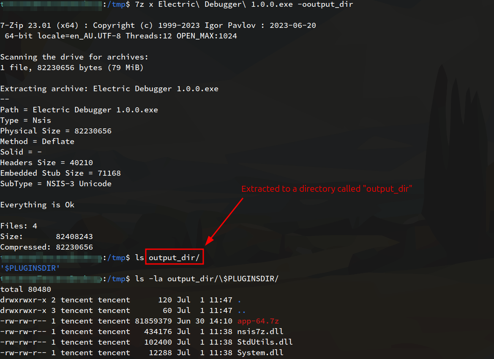
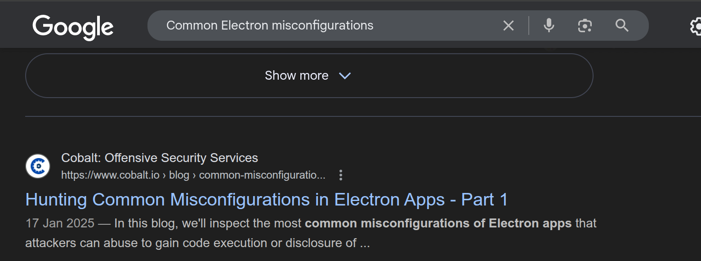
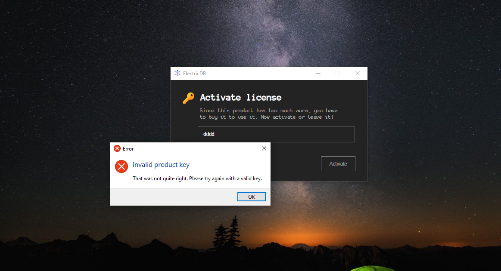
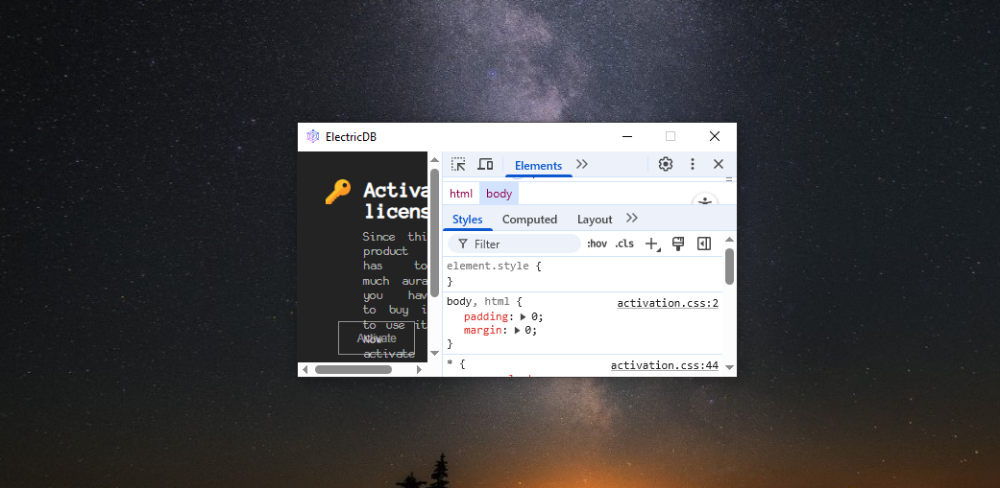
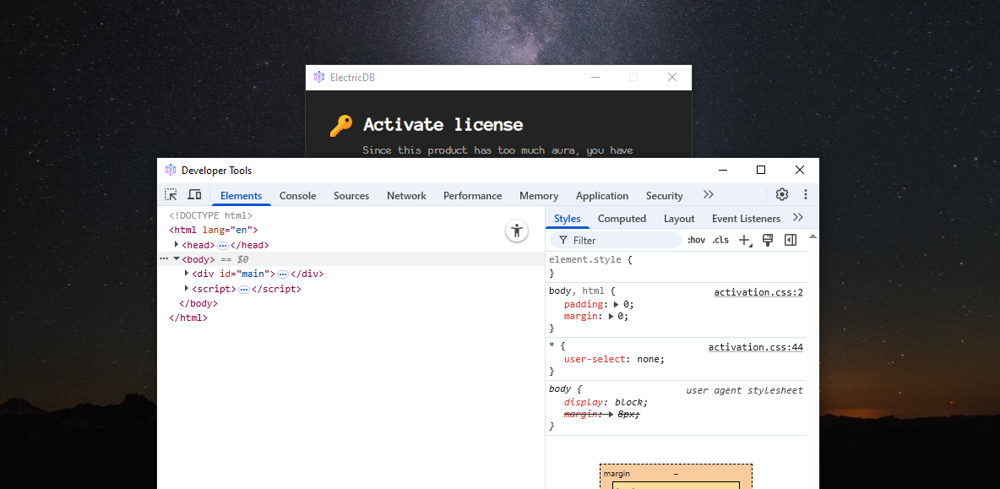
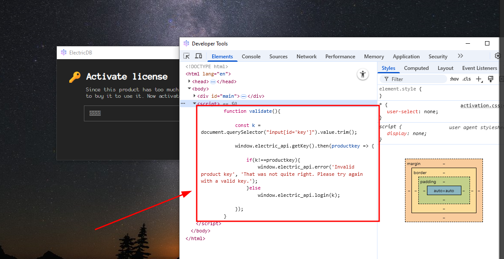
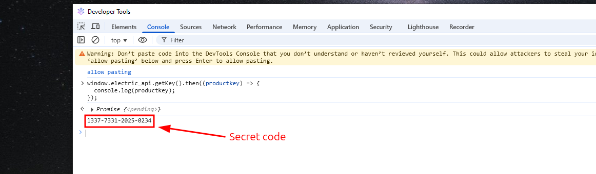
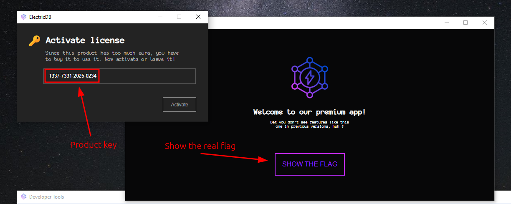
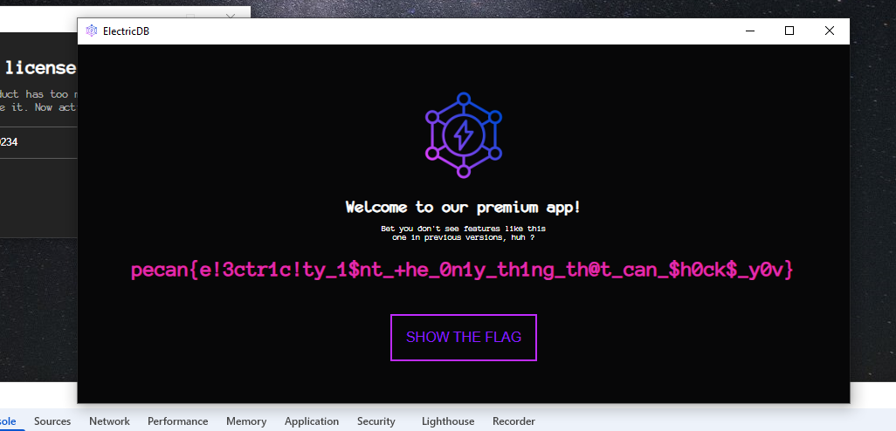

# Electric Debugger

- Author: ScriptKidding

## Overview

Some core concepts of this challenge include:

1. Electron misconfiguration.
2. Hardcoded secrets.

## Hints

1. It is sometimes good practice to figure out what the executable was built in first before trying to exploit it ( WinForm, Flutter, or PyGt ? )
2. Once the framework is known, you can try to Google its common mistakes and vulnerabilities. Also know that it's ok if you do not know everything, cybersecurity is ever-evolving and a learn-on-the-go topic.

## Writeup

### Step 1: Enumeration

Whenever you are given an executable, you can try to reverse engineer it at first glance with [ghidra](https://github.com/NationalSecurityAgency/ghidra), [radare2](https://github.com/radareorg/radare2), etc. But, if you check the filesize of the `Electric Debugger 1.0.0.exe`, it is nearly 80MB, which is relatively large for a typical `.exe` file. This is a good sign that it was coded in certain frameworks, but it's not guaranteed.

All this means is that maybe we should do some enumeration, such as checking the file type or extracting as much information about the executable first, before trying to reverse engineer the entire thing as a last resort.

First, we can check the file type.

```bash
file Electric\ Debugger\ 1.0.0.exe
# Output ---> Electric Debugger 1.0.0.exe: PE32 executable (GUI) Intel 80386, for MS Windows, Nullsoft Installer self-extracting archive, 5 sections
```

Interesting, it's a common executable, yet it is also a self-extracting archive which was bundled using Nullsoft. This means that we can use tools like `7zip` to **_unzip_** this executable.



Now we can certainly ignore those `.dll` files since they are supporting libraries files, the interesting detail is the inner file `app-64.7z`. Try to unzip it again.

```shell
$ 7z x app-64.7z -oappdir
```

And you will find some interesting details in the extracted folder.


You can see that there is a file called `LICENSE.electron.txt` and some Chromium bundles. This means that this was coded using [ElectronJS](https://www.electronjs.org/), a cool way to code desktop apps using JavaScript, HTML, and CSS just like you are developing a web application :D

### Step 2: Exploitation

In case of doubt, Google can be a pretty good companion; you don't have to know everything right now, so just learn on the go. The thing that separates good developers and pentesters from normal ones can sometimes be how good their `Google-fu` is.

So, what to do when you know it's based on Electron? Now, if you are familiar with the common Electron mistakes, feel free to go at it. But if not, just Google things ike `Common Electron misconfigurations`.



Now feel free to read all of it to learn more, but spoiler alert! Among all of those mistakes, `Debug mode enabled` was the one. Ok, so first, try to run the executable on a Windows VM or machine.



Now you can even do `Ctrl -` to minimize the activation form. But to check for debug mode enabled on Electron, we can try the key combinations of `Ctrl - Shift - I` to see whether it actually opens up the Chromium developer console.



Feel free to detach it to make it bigger.



Now whenever there is a dev-console, some things may come to mind, such a inspecting the source code to see if there is anything interesting. And indeed, it does...



### Step 3: Capture The Flag

Based on the logic of the captured piece of code below.

```js
function validate(){

    const k = document.querySelector("input[id='key']").value.trim();
    
    window.electric_api.getKey().then(productkey => {

        if(k!==productkey){
            window.electric_api.error('Invalid product key', 'That was not quite right. Please try again with a valid key.');
        }else
            window.electric_api.login(k);

    });
}
```

It may be obvious that whenever someone enters the invalid product key, it will generate a popup saying `That was not quite right. Please try again with a valid key`. And since the logic of the code was quite bad, we can just execute the code below to grab the product key since it is hardcoded as a method in the application.

```js
window.electric_api.getKey().then((productkey) => {
  console.log(productkey);
});
```



So the key is `1337-7331-2025-0234`. Great! We can try out the product key now.



The key is correct! Now all we have to do is click the "SHOW FLAG" button.



Pwned The flag is:
+ `pecan{e!3ctr1c!ty_1$nt_+he_0n1y_th1ng_th@t_can_$h0ck$_y0v}`
