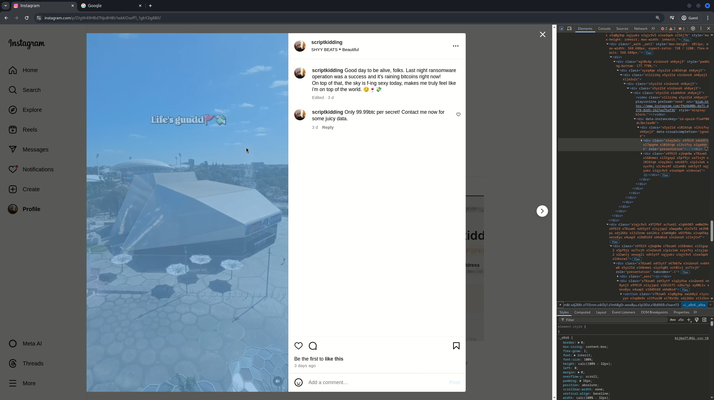

# Ego is the weakness

> A ransomware operation was spotted recently which resulted in millions of dollars lost in seconds. After some collaborative investigation with the governments, we traced its activities back to an Instagram account, which was believed to belong to the culprit. Can you help us identify at least the address of the place that this cybercriminal usually visits? So far our intel told us that there is a high chance this person is still young, so he/she hasn't graduated yet.
> Link: https://www.instagram.com/scriptkidding/

# Flag format

Flag format: `pecan{Paste in the address From Google Map}`

## Writeup

Ok so we need to get the `Place that the attacker usually visits`

And from the Instagram profile investigation, the second post is only when he was traveling using the ransom money and the third point was just him flexing their trophies.

But if you pay attention to the first post, and try to google reverse search the weird-looking building, you will know that it's captured from Adelaide.



There are many ways to extract the images and videos on Instagram, either via manual inspection on the browser or using oneline applications.


But that's not gauranteed that this guy is from Adelaide or it was just his/her vacation but if you were to check the highlighted stories and do some reverse searching using Google lens as follows...


So the building is `Roma Mitchell House` and it's also located in Adelaide, now a bit further investigation using Google Maps and you will know that there is a tall building behind this building.


Based on some logical mapping, it was very clear that the highlight was captured from the tall building with the `Flinders University` logo. Now there are two methods of following this:

1. Search for all Flinders University locations in Adelaide and check the location of each, see which one looks like that tall building
2. Play around with Google Map

If you choose method number 2, you will see that this place is also called `Festival Tower` and if you check its uploaded images, it gives us some hints as well.


So that has a really high chance of being the place that the culprit usually visits and it also matches with the view from the first post as well. Now recall from the intel from the description of this challenge

```
... so he/she hasn't graduated yet
```

Yep, very likely he/she is still a student and visits this place frequently as well. The address of Festival Tower is `Station Rd, Adelaide SA 5000`

## Flag

So the flag is `pecan{Station Rd, Adelaide SA 5000}`
