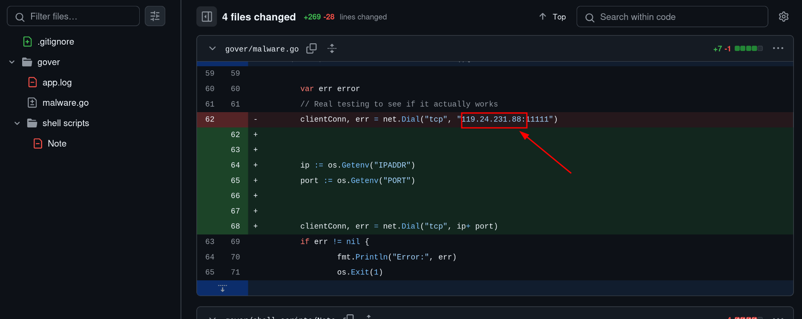

# Go git the door

Link to challenge: https://github.com/PHP-Abuse-Me/10th-operation-backdoor

This challenge focuses on the potential information leakage in git commit history. Even though it simulates a criminal scenario, this can also happen with real-life enterprises where they leak an API key, and once that key is uploaded, it's nearly impossible to get rid of. The best way would be to just build a whole new repository and delete the old one.

So always remember to add `.gitignore`, folks :D

In a nutshell, there are 2 methods to do this.

## Method 1

Simply checking every commit hash to see what the IP addresses are, but that can cost lots of time. But eventually you will see something like this



## Method 2 ( RECOMMENDED )

Using the power of the `git` command, we can craft something like this to ease our time, like the following commands.

```bash
# STEP 1: Clone the repository
# STEP 2: CD to that repository
# STEP 3: Run the command below
git log -p | grep -Eo '([0-9]{1,3}\.){3}[0-9]{1,3}' | sort --unique
```

The result will be something like this.

```
10.10.10.10
119.24.231.88
127.0.0.1
249.91.101.163
8.8.8.8
```

Now we all know that `127.0.0.1` is the localhost address, `8.8.8.8` is the Google DNS address, and `10.10.10.10` is a private IP address. So the suspicious IP addresses that are public are:

- **Address 1**: 249.91.101.163
- **Address 2**: 119.24.231.88

## Flag

You can try both combinations, either.

- `pecan{249.91.101.163_119.24.231.88}`
- `pecan{119.24.231.88_249.91.101.163}`
