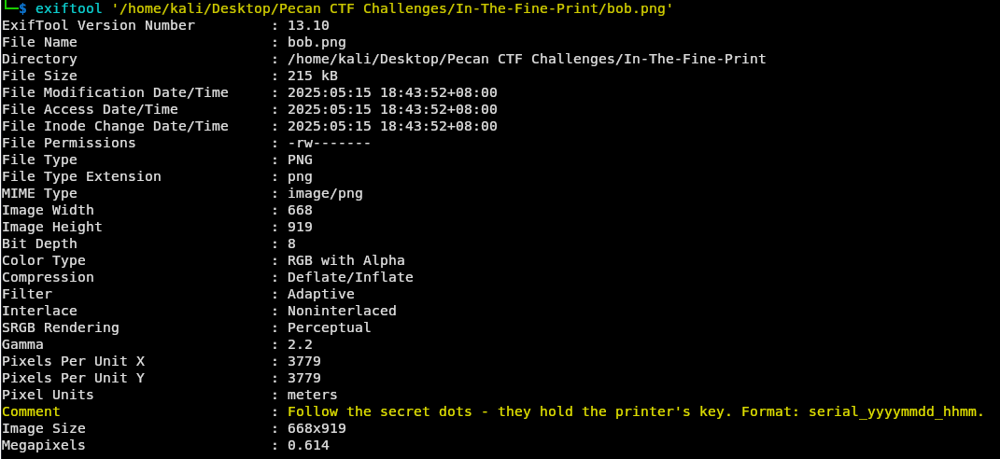
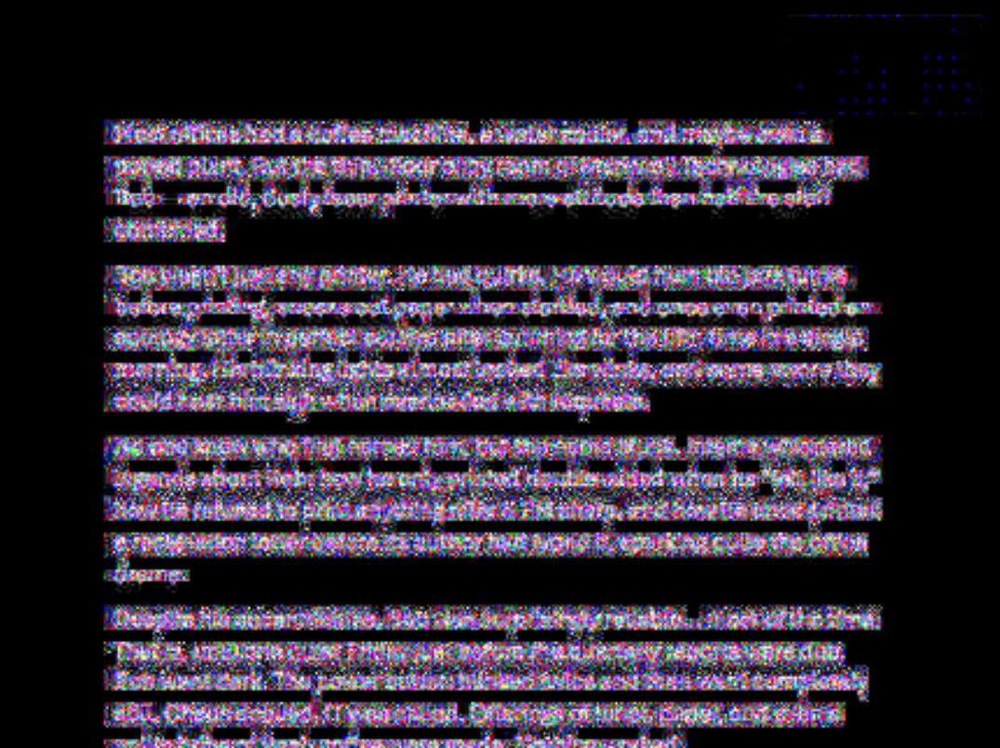
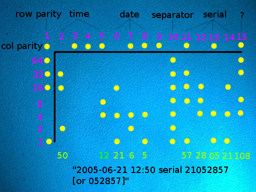
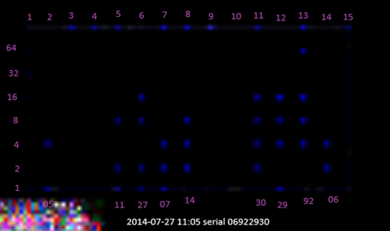
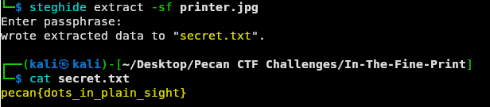

This CTF is a 2-step challenge. Challengers are provided two files, "bob.png" and "printer.jpg", containing a innocent story about Bob the printer and a picture of a printer, respectively.

Using exiftool, looking at the EXIF data of bob.png, it shows a user-created comment.

The hint mentions "secret dots" which may sound like writing fluff but the term, secrets dots, is actually an alias for printer tracking dots which can easily be found out by with a quick google search.

As many online articles will explain, printer tracking dots are a form of identification for printers that provides the serial number of a printer and the exact date/time a page was printed. These dots are yellow in color and can be revealed with manual color channel isolation - more specifically, channel isolating to yellow's opposite which is blue. You could also use an online image forensics tool such as FotoForensics to do this automatically for you.

Using a guide such as the image below, it is quite easy to decode.

The dots are split into rows and columns, the topmost row and leftmost column are a parity row and column for error detection. Each column is read top-to-bottom as a single byte of seven bits, **adding the bit values** while omitting the first parity bit; the bytes are then read **right to left**. Knowing this, the dots can be decoded as:

Remembering the hint from the beginning, it mentioned some format of  **serial_yyyymmdd_hhmm**. We can use the newly found tracking dots information and plug it into this format -  **06922930_20140727_1105**.

The hint also mentioned that the dots would "hold the printer's key". With a bit of thinking, you can conclude that it is referring to some sort of password for printer.jpg.

Steghide is a tool commonly used in steganography challenges to embed a file inside another file (in this case, a JPG). Running steghide on "printer.jpg" and using the discovered password of  "06922930_20140727_1105", successfully reveals "secret.txt" which contains the flag!

