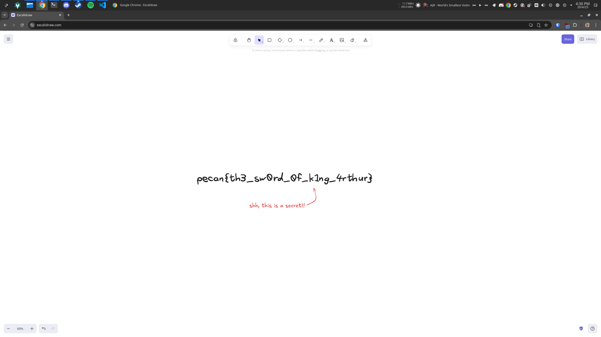

# Nothing to see here

## Introduction / Overview

This challenge involves analysing an image file that has been generated using the online drawing tool "Excalidraw", which can encode scene metadata into exported files, where the image has been tampered to combine the metadata from one file with the visual/image data from another.
By analysing EXIF information, you can see that the image has been exported from excalidraw, and if you load it into excalidraw, you can see a different scene altogether is loaded up.

## Steps to solve

A great first step when looking at any image-based steg challenge is to look at the EXIF information contained within the file, using something like `exiftool`. You can do this with the following command:

```sh
exiftool image.png
```

Once you run this, you would see an output similar to the following:

```
ExifTool Version Number         : 12.70
File Name                       : image.png
Directory                       : .
File Size                       : 117 kB
File Modification Date/Time     : 2025:04:20 16:07:14+10:00
File Access Date/Time           : 2025:04:20 16:07:14+10:00
File Inode Change Date/Time     : 2025:04:20 16:07:14+10:00
File Permissions                : -rw-r--r--
File Type                       : PNG
File Type Extension             : png
MIME Type                       : image/png
Image Width                     : 584
Image Height                    : 784
Bit Depth                       : 8
Color Type                      : RGB with Alpha
Compression                     : Deflate/Inflate
Filter                          : Adaptive
Interlace                       : Noninterlaced
SRGB Rendering                  : Perceptual
Warning                         : [minor] Text/EXIF chunk(s) found after PNG IDAT (may be ignored by some readers)
Applicationvndexcalidrawjson    : {"version":"1","encoding":"bstring","compressed":true,"encoded":"<a bunch of garbled text>"}
Image Size                      : 584x784
Megapixels                      : 0.458
```

Straight away, this gives us some very useful clues. In particular, we can see that `exiftool` has picked up some text chunks/data after the main png "IDAT" data block. We can also see it's picked up a field called "Applicationvndexcalidrawjson" which seems to hold some JSON data. The JSON data appears to describe an encoded and compressed string, which we can't easily read.

The name of the new field is a useful clue though, as 'Applicationvndexcalidrawjson" sounds similar to a file type, where "vndexcalidraw" might be a custom application that expects this JSON data.

A quick google search of "Applicationvndexcalidrawjson" or "vndexcalidraw" pulls up a bunch of links related to a web drawing tool called "excalidraw". Maybe we can open the image file using this?

If we open the file in excalidraw, we see the following:



And from this, we have the flag!

## Useful takeaways and tips for future challenges

- EXIF analysis is never a bad place to start with steg challenges. It can often uncover useful information about how a file was created.
- It's possible to modify the image data of an image file separately to its metadata, and vice-versa, so be careful never to completely trust either, as images might be tampered.
- Googling weird names and fields is a good way to uncover quick solutions and tools useful for whatever you're trying to analyse.
