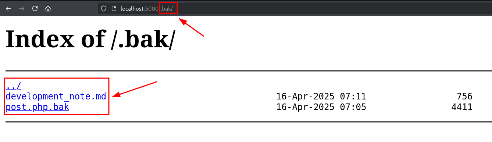
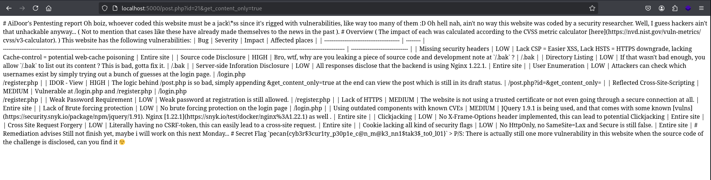
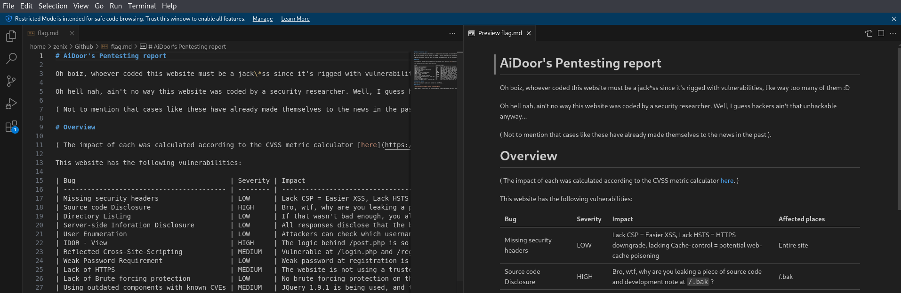

# AiDoor

- Author: ScriptKidding

## Note

The posts from this challenge's website were my real-life pentesting experiences. Since this CTF is aimed at students, I guess it would be nice to share some of the insight in the cybersecurity field for educational purposes. If you are a beginner in cyber, feel free to check them out.

## Writeup

This is actually a very simple challenge combining a little bit of `IDOR` and `Basic Business Logic design flaws`.

### STEP 1: Play around with the web

This basically means:

1. Create an account
2. Login
3. Click and view some available pages to see how things work.
   And then I reckon that there is an `id` that I can try to hack at `/post.php?id=`, and so I tried...

- SQLi -> Not working
- Command Injection -> Not working

So the next thing that comes to mind is `IDOR` which is to see whether there is any ID that we can access which we should not.

### STEP 2: Enumeration

I tried to increment the id to 9 since the maximum one is 8 and it doesn't show anything.


Then i tried to decrement the id to 0 since the lowest ID number that we currently have is 1 to see if it has something good, and it is...


So a `draft` should not be public and properly, from a black-box tester's perspective, there is a good chance that only the administrators who posted the blogs can view it.

But at the moment, those are just predictions and there is obviously no way we will know how to bypass this to get the actual content.

But recalling back from the hint...

### STEP 3: Source code disclosure

According to the hint:

> Sometimes, ".bak" is a common folder that developers use to back up their code, hopefully, it's not publicly exposed through the web :O

We can check to see if any piece of source code is disclosed at `/.bak` and indeed, there is.


Click on the `development_note.md` and you will see the crazy convo between those developers, which also discloses that the source code of `/post.php` is stored inside `post.php.bak`.

If you view the `post.php.bak` file, it will look kinda messed up, so it's better that we copy it to a file and then try to open it using any code editor like vscode to understand it further.


HHHmmm, so the actual code is commented, now try to uncomment it then read it. And if you spend enough time trying to understand it, you will stumble across this block of code.


so line 45 is executed before line 51 and line 51 is the one that threw us that error message, and at the same time, the content of the post will be shown if we provide it with `get_content_only=true`.

So let's try again...


And yep, we have now disclosed the content of the post of ID 0, but there is no flag yet.

### STEP 4: Capture The Flag

So far, the only thing left is to somehow do a RCE or upload keep brute forcing something, it can be the ID though but brute forcing is usually a no-brainer. But again, if you paid attention to the source code, there is another line like this which may catch your attention.


That means the ID should be within the range of 0 to 50. This leads me to think that what if there is another secret post out there but it has a different ID between the range of 0 to 50? Ok, that means we should try to craft a basic script to extract the response from all requests with the ID from 9 to 50 ( Since we already knew the content of ID 0 to 8 )

```bash
# Remember to replace the "Cookie" with your cookie.
for i in $(seq 9 50); do echo -n "ID=${i} :"; curl -H "Cookie: PHPSESSID=hrkra63t9hc0ekp95bis9j3q0f" "http://localhost:5000/post.php?id=${i}";print "" ; done
```

And you will get something like this...

```
ID=9 :No such post exist with id=9
ID=10 :No such post exist with id=10
ID=11 :No such post exist with id=11
ID=12 :No such post exist with id=12
ID=13 :No such post exist with id=13
ID=14 :No such post exist with id=14
ID=15 :No such post exist with id=15
ID=16 :No such post exist with id=16
ID=17 :No such post exist with id=17
ID=18 :No such post exist with id=18
ID=19 :No such post exist with id=19
ID=20 :No such post exist with id=20
ID=21 :{"status":403,"message":"This post is currently a draft, only administrators can access it."}
ID=22 :No such post exist with id=22
ID=23 :No such post exist with id=23
ID=24 :No such post exist with id=24
```

Great, ID=21 is another draft, repeat the previous exploitation step and you will be shown something as follows:



God, that looks awful, if you are professional at writing documentation, you will know that these ugly pieces of text are from a Markdown file, which is similar to what I am using to write this writeup on GitHub right now. So we have some choices, either you have a sharp eye that immediately spots the flag among this chaos, or you can try out software like [Obsidian](https://obsidian.md/), Vscode, or an online platform such as https://dillinger.io/ to make it looks more readable.

```bash
# Remember to replace the "Cookie" with your Cookie
curl -H "Cookie: PHPSESSID=hrkra63t9hc0ekp95bis9j3q0f" "http://localhost:5000/post.php?id=21&get_content_only=true" -o flag.md
```

Then use Vscode or Obsidian to open `flag.md`



Scroll down a little bit and the flag will be yours!


- Flag : `pecan{cyb3r$3cur1ty_p30p1e_c@n_m@k3_nn1$tak3$_to0_l01}`
